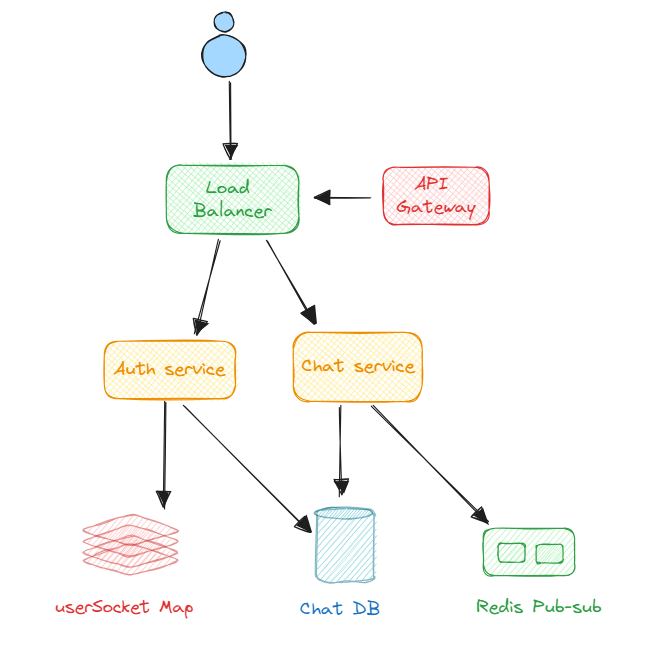

# whatsapp-hld

A whatsapp like chat application with end to end High level design

The application includes 4 services. The focus is more on building a high level design of the application and not on the development. 

Considerations include- 

1-1 messaging

Pub sub architecture for multiple server setup

Containerization and orchestration for easy replication and fault tolerance

NoSQL schema for ease of development

Load Balancer - AWS ELB

Cache- userSocket Map to identify websocket connection server
DB - MongoDB to stopre user and messages information

Pub-sub- Redis Pub sub to publish messages to be accessed by users connected to different chat servers

API Gateway- Node API gateway to distribute traffic to right service

Containerization- Docker and AWS ECS

Servers- EC2 instances
